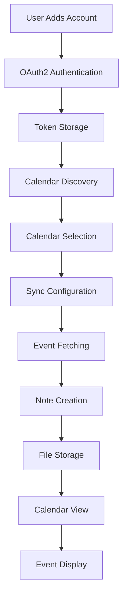

# Google Calendar Sync Process - Complete Documentation

## 🎯 Overview

The Google Calendar sync process is designed to seamlessly integrate multiple Google Calendar accounts with Obsidian, creating event notes from calendar events and displaying them in a custom calendar view.

## 📋 Workflow Process

### 1. **Account Setup Phase**

#### Step 1: Plugin Settings Access
- User opens Obsidian Settings → Community Plugins → Second Brain Integration
- Navigates to "Master Calendar Settings" section

#### Step 2: Add Google Account
- Click "Add Google Account" button
- Enter Google OAuth2 credentials:
  - Client ID (from Google Cloud Console)
  - Client Secret (from Google Cloud Console)
  - Account name/email
- Click "Authenticate" to generate OAuth URL

#### Step 3: OAuth2 Authentication
- System opens Google OAuth consent screen in browser
- User selects Google account and grants calendar permissions
- Google returns authorization code
- User copies code and pastes into "Exchange Code" field
- System exchanges code for access/refresh tokens

#### Step 4: Account Verification
- Account appears in "Connected Accounts" table
- Shows account status: ✅ Connected / ❌ Error / ⚠️ Token Expired
- Displays last sync time and enabled/disabled status

### 2. **Calendar Discovery Phase**

#### Step 5: Calendar Discovery
- System automatically discovers all calendars for connected account
- Displays calendars in expandable table under each account:
  ```
  📧 user@gmail.com (Connected)
    ├── 📅 Primary Calendar (enabled)
    ├── 📅 Work Calendar (disabled)
    ├── 📅 Personal Events (enabled)
    └── 📅 Shared Calendar (disabled)
  ```

#### Step 6: Calendar Selection
- User can enable/disable individual calendars via toggles
- Set priority levels for conflict resolution (1-10)
- Configure sync direction: Read-only / Write-only / Bidirectional

### 3. **Multi-Account Support**

#### Step 7: Additional Accounts
- Repeat Steps 2-6 for additional Google accounts
- Each account maintains independent calendar selections
- System handles token refresh automatically for all accounts

### 4. **Synchronization Phase**

#### Step 8: Sync Configuration
- Configure sync settings:
  - **Date Range**: Week / Month / Quarter / Year / Custom
  - **Event Creation**: Enable/disable automatic note creation
  - **Template Settings**: Choose event note templates
  - **Folder Structure**: Set event notes folder location

#### Step 9: Manual Sync Process
- Click "Sync All Calendars" button
- System performs the following for each enabled calendar:
  1. **Fetch Events**: Retrieve events from Google Calendar API
  2. **Create Notes**: Generate Obsidian notes using templates
  3. **Store Files**: Save notes in configured events folder
  4. **Update Cache**: Cache events for calendar view

#### Step 10: Auto-Sync (Optional)
- Enable automatic sync with configurable intervals
- Background sync runs without user intervention
- Notifications for sync completion/errors

### 5. **Calendar View Phase**

#### Step 11: Calendar Visualization
- Open Master Calendar from ribbon icon or command palette
- Calendar view reads event notes from events folder
- Displays event dots on calendar dates:
  - 🔵 Single event
  - 🔵🔵 Multiple events
  - Different colors for different calendars

#### Step 12: Event Interaction
- Click on calendar date to view events
- Click on event to open corresponding note
- Navigate between Month/Week/Day/Agenda views

## 🔧 Technical Implementation

### Data Flow Architecture



### File Structure

```
events/
├── Meeting with Team - 2025-08-01.md
├── Doctor Appointment - 2025-08-02.md
├── Project Deadline - 2025-08-05.md
└── templates/
    ├── default-event.md
    ├── meeting-event.md
    └── all-day-event.md
```

### Event Note Template Example

```markdown
---
type: calendar-event
title: "Team Meeting"
date: 2025-08-01
start-time: "14:00"
end-time: "15:00"
calendar: "Work Calendar"
calendar-id: "work@company.com"
event-id: "abc123xyz"
tags: [meeting, work, team]
---

# 🤝 Team Meeting

**Date:** Thursday, August 1st, 2025  
**Time:** 2:00 PM - 3:00 PM  
**Location:** Conference Room A  
**Calendar:** Work Calendar

## Attendees
- John Doe
- Jane Smith
- Bob Wilson

## Agenda
- Project status update
- Q3 planning
- Budget review

## Meeting Notes
<!-- Add notes during meeting -->

## Action Items
- [ ] Complete project proposal
- [ ] Schedule follow-up meeting
- [ ] Review budget allocation

## Related
[[Project Planning]] | [[Team Updates]]
```

## 🚀 Advanced Features

### 1. **Conflict Resolution**
- Handle duplicate events across multiple calendars
- Priority-based resolution using calendar priorities
- Manual resolution interface for complex conflicts

### 2. **Smart Templates**
- Auto-select templates based on event characteristics:
  - Meeting events (has attendees) → meeting-event.md
  - All-day events → all-day-event.md
  - Default events → default-event.md

### 3. **Sync Statistics Dashboard**
```typescript
interface SyncStats {
  totalAccounts: number;        // 3 accounts
  activeAccounts: number;       // 2 active
  totalCalendars: number;       // 8 calendars
  activeCalendars: number;      // 5 syncing
  totalEvents: number;          // 127 events
  lastSyncTime: string;         // "2025-08-01T10:30:00Z"
}
```

### 4. **Error Handling & Recovery**
- Automatic token refresh
- Graceful handling of API rate limits
- Offline mode with cached data
- Detailed error logging and user notifications

## 🎨 UI/UX Improvements Suggested

### 1. **Enhanced Settings Interface**
- Tabbed interface for better organization
- Real-time connection status indicators
- Bulk calendar enable/disable options
- Calendar preview with event counts

### 2. **Improved Calendar View**
- Color-coded events by calendar
- Event density visualization
- Quick event creation from calendar
- Event filtering and search

### 3. **Sync Status Dashboard**
- Real-time sync progress indicators
- Last sync timestamps per account
- Error logs and resolution suggestions
- Sync statistics and analytics

### 4. **Template Management**
- Visual template editor
- Template preview functionality
- Custom variable support
- Template sharing and import/export

## 📊 Performance Optimizations

### 1. **Caching Strategy**
- In-memory event cache for fast calendar rendering
- Persistent cache for offline access
- Smart cache invalidation on sync

### 2. **Incremental Sync**
- Only fetch events modified since last sync
- Delta sync to minimize API calls
- Intelligent change detection

### 3. **Batch Operations**
- Bulk event processing
- Parallel calendar sync
- Rate limit management

## 🔒 Security Considerations

### 1. **Token Management**
- Secure token storage in Obsidian settings
- Automatic token refresh
- Token revocation on account removal

### 2. **API Security**
- OAuth2 best practices
- Scope limitation (read-only by default)
- Error message sanitization

## 📈 Future Enhancement Ideas

### 1. **Two-Way Sync**
- Create Google Calendar events from Obsidian notes
- Edit event details in Obsidian
- Bidirectional conflict resolution

### 2. **Advanced Integrations**
- Task plugin integration
- Daily notes integration
- Graph view connections

### 3. **Collaboration Features**
- Shared calendar views
- Team event synchronization
- Meeting note collaboration

### 4. **Analytics & Insights**
- Time tracking from calendar events
- Meeting frequency analysis
- Calendar utilization reports

## 🐛 Known Limitations & Considerations

1. **API Limits**: Google Calendar API has rate limits (1000 requests/100 seconds)
2. **Token Expiry**: Refresh tokens may expire after 6 months of inactivity
3. **Large Calendars**: Performance may degrade with 1000+ events
4. **Network Dependency**: Requires internet connection for sync
5. **Storage**: Event notes consume vault storage space

## 📝 Best Practices

1. **Regular Sync**: Enable auto-sync for up-to-date events
2. **Template Consistency**: Use standardized templates across team
3. **Folder Organization**: Organize events by date or project
4. **Backup Strategy**: Regular vault backups for event notes
5. **Access Management**: Use dedicated Google account for calendar sync

This comprehensive sync process provides a robust, user-friendly way to integrate Google Calendar with Obsidian while maintaining flexibility and scalability for multiple accounts and calendars.
