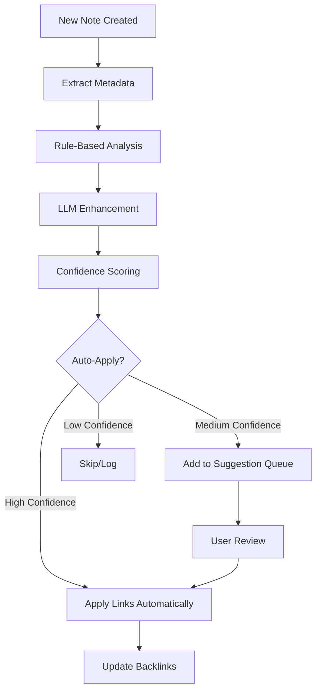

# Automatic Note Linking & Tagging System

## Overview

This system automatically creates links, backlinks, and tags for every new note created from calendar events and Plaid transactions by analyzing existing vault content and applying intelligent rules.

## Architecture

### Core Components

1. **Note Analysis Service** - Analyzes existing vault notes for patterns
2. **Linking Rules Engine** - Applies deterministic and LLM-powered rules
3. **Relationship Discovery Service** - Finds connections between notes
4. **Auto-Tagging Service** - Generates contextual tags
5. **Link Application Service** - Applies links and updates backlinks

### Data Flow



## Linking Rules Framework

### 1. Time-Based Linking (High Confidence)
**Rule**: `abs(start_time - end_time) ≤ Δt`

```typescript
interface TimeBasedRule {
  timeWindow: number; // minutes (e.g., 120 for 2 hours)
  priority: 'high' | 'medium' | 'low';
  autoApply: boolean;
}

// Example matches:
// - "Coffee with John" (calendar) ↔ "Starbucks $5.50" (transaction)
// - "Lunch Meeting" (calendar) ↔ "Restaurant $45.00" (transaction)
```

### 2. Entity-Based Linking (High Confidence)
**Rule**: Exact or fuzzy string match on people, vendors, locations

```typescript
interface EntityRule {
  entityTypes: ['person', 'vendor', 'location', 'company'];
  matchThreshold: number; // 0.8 for 80% similarity
  sources: ['attendees', 'merchant', 'location', 'title', 'description'];
}

// Example matches:
// - "Meeting with Acme Corp" ↔ "Acme Corp Invoice" ↔ "Acme Payment $1000"
// - Attendee "john.doe@company.com" ↔ Other events with same attendee
```

### 3. Location-Based Linking (Medium Confidence)
**Rule**: Geographic proximity within radius

```typescript
interface LocationRule {
  radiusMeters: number; // 500m default
  sources: ['event.location', 'transaction.location', 'note.frontmatter.location'];
  includeVenues: boolean; // Match venue names even without coordinates
}

// Example matches:
// - Events at "Conference Room A" ↔ Other meetings in same room
// - Transactions at "Whole Foods, 123 Main St" ↔ Events near that location
```

### 4. Category/Project Linking (Medium Confidence)
**Rule**: Controlled vocabulary mapping

```typescript
interface CategoryRule {
  vocabularies: {
    projects: string[];      // "project:XYZ"
    categories: string[];    // "category:food", "category:travel"
    topics: string[];        // "topic:quarterly-planning"
  };
  sources: ['frontmatter.tags', 'content.text', 'title'];
}

// Example matches:
// - All notes tagged "project:website-redesign"
// - Food transactions ↔ Lunch meetings ↔ Restaurant reviews
```

### 5. UID Continuity (Highest Confidence)
**Rule**: External ID appears in multiple notes

```typescript
interface UIDRule {
  uidSources: ['ical_uid', 'transaction_id', 'event_id', 'custom_ref'];
  linkStrength: 'strong'; // Creates [[]] links
  autoApply: true;
}

// Example matches:
// - Recurring calendar events with same ical_uid
// - Split transactions with reference IDs
```

## Implementation Plan

### Phase 1: Rule Engine Foundation
1. **Create LinkingRulesService**
   - Define rule interfaces and types
   - Implement confidence scoring (0-1)
   - Add rule priority system

2. **Vault Analysis Service**
   - Scan existing notes for patterns
   - Build entity extraction (people, companies, locations)
   - Create searchable indices

3. **Basic Time & Entity Rules**
   - Implement time window matching
   - Add fuzzy string matching for entities
   - Test with existing calendar/transaction data

### Phase 2: Enhanced Pattern Recognition
1. **Location Services**
   - Add geocoding for addresses
   - Implement proximity calculations
   - Match venue names and addresses

2. **Category Intelligence**
   - Build controlled vocabulary from existing tags
   - Add semantic category matching
   - Implement project/topic clustering

3. **LLM-Powered Rules**
   - Enhance existing suggestion system
   - Add relationship discovery prompts
   - Implement confidence calibration

### Phase 3: Smart Application & Learning
1. **Auto-Application Logic**
   - High confidence rules (>0.85) auto-apply
   - Medium confidence (0.5-0.85) to suggestion queue
   - Low confidence (<0.5) logged for analysis

2. **User Feedback Loop**
   - Track user approval/rejection patterns
   - Adjust confidence thresholds
   - Learn from manual link creation

3. **Performance Optimization**
   - Cache frequently accessed data
   - Optimize rule execution order
   - Background processing for large vaults

## Service Integration

### Enhanced Transaction Processing
```typescript
class TransactionProcessingService {
  async createTransactionNote(transaction: Transaction) {
    // 1. Create note with template
    const note = await this.createNote(transaction);
    
    // 2. Run linking rules
    const linkSuggestions = await this.linkingService.analyzeNote(note);
    
    // 3. Auto-apply high confidence links
    await this.linkingService.applyHighConfidenceLinks(linkSuggestions);
    
    // 4. Queue medium confidence for review
    await this.suggestionService.queueLinkSuggestions(linkSuggestions);
    
    return note;
  }
}
```

### Enhanced Calendar Processing
```typescript
class EventTemplateService {
  async createEventNote(event: CalendarEvent) {
    // 1. Create event note
    const note = await this.createNote(event);
    
    // 2. Find time-based connections
    const timeLinks = await this.linkingService.findTimeBasedLinks(event);
    
    // 3. Find entity-based connections
    const entityLinks = await this.linkingService.findEntityLinks(event);
    
    // 4. Apply and suggest links
    await this.linkingService.processLinks([...timeLinks, ...entityLinks]);
    
    return note;
  }
}
```

## Configuration Options

### Settings Structure
```typescript
interface LinkingSettings {
  enabled: boolean;
  
  timeBasedRules: {
    enabled: boolean;
    windowMinutes: number;
    autoApplyThreshold: number;
  };
  
  entityRules: {
    enabled: boolean;
    fuzzyMatchThreshold: number;
    enabledTypes: ('person' | 'company' | 'location')[];
  };
  
  categoryRules: {
    enabled: boolean;
    useExistingTags: boolean;
    projectTagPattern: string; // "project:*"
  };
  
  autoApplication: {
    highConfidenceThreshold: number;  // 0.85
    mediumConfidenceThreshold: number; // 0.5
    maxLinksPerNote: number; // 10
  };
  
  llmEnhancement: {
    enabled: boolean;
    enhanceExistingRules: boolean;
    generateNewConnections: boolean;
  };
}
```

## Benefits

### Immediate Value
- **Automatic Context**: Every transaction gets linked to related meetings
- **Project Tracking**: All project-related notes auto-connect
- **Time Correlation**: Spending patterns linked to calendar events
- **Entity Networks**: People/company relationship mapping

### Long-term Intelligence
- **Pattern Learning**: System learns from your linking preferences
- **Vault Insights**: Discover hidden connections in your data
- **Smart Suggestions**: Increasingly accurate relationship predictions
- **Knowledge Graph**: Rich interconnected personal knowledge base

## Next Steps

1. **Phase 1 Implementation** (Week 1-2)
   - Create `LinkingRulesService` foundation
   - Implement time-based and entity rules
   - Add to transaction/event creation workflow

2. **Integration Testing** (Week 3)
   - Test with existing vault data
   - Tune confidence thresholds
   - Validate auto-application logic

3. **UI Enhancement** (Week 4)
   - Add linking settings to UI
   - Show link suggestions in approval view
   - Add link relationship visualization

This system will transform your Second Brain from a collection of notes into a truly intelligent, interconnected knowledge network that automatically grows and strengthens with each new piece of data.
